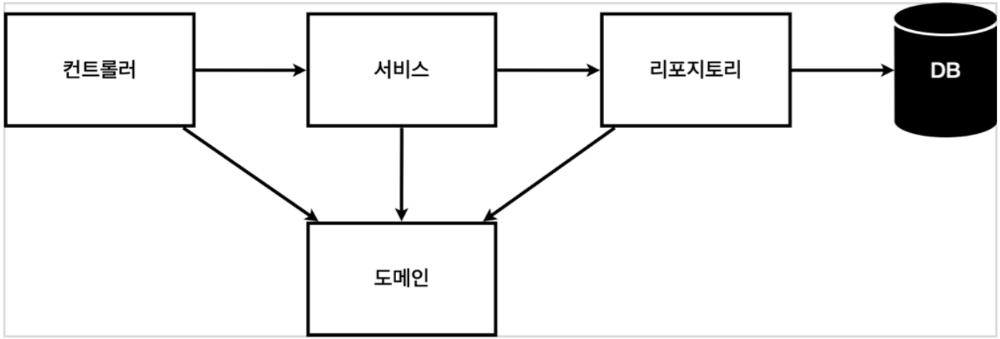
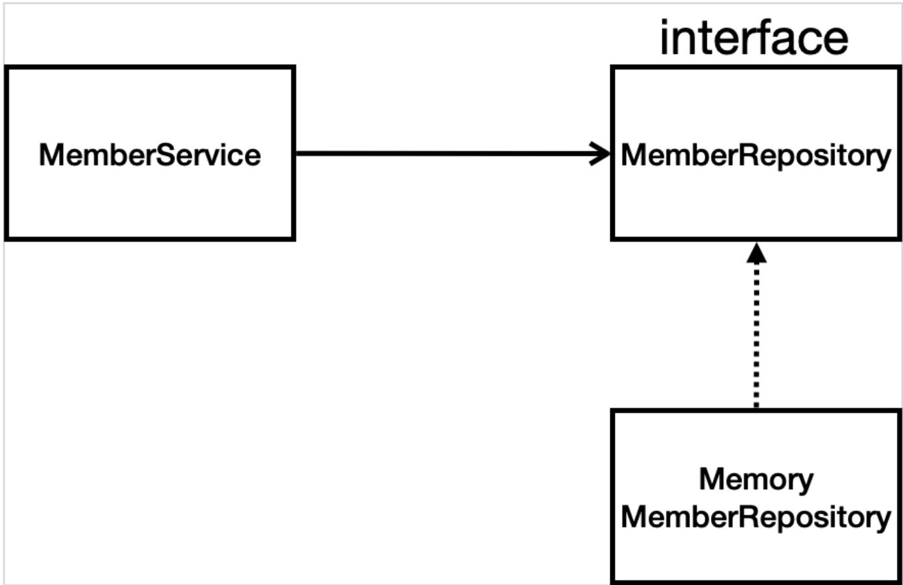
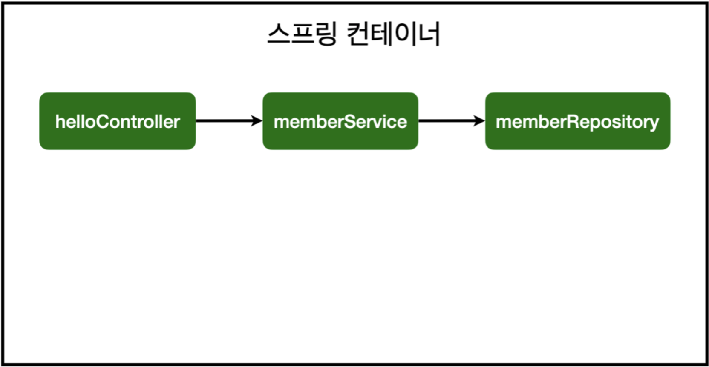

이 프로젝트는 인프런 강의 "김영한의 스프링 입문 코드로 배우는 스프링 부트, 웹 MVC, DB 접근 기술"을 토대로 만들어졌습니다.

# 프로젝트 기본 세팅

- 환경
    - Java 11
    - IntelliJ IDEA CE
    - Gradle
- 스프링 부트 이니셜라이저 세팅

    [https://start.spring.io](https://start.spring.io/)

    - Project → Gradle
    - Spring Boot → 2.3.x
    - Language → Java
    - Packaging → jar
    - groupId → com.example
    - artifactId → spring-boot-memberService-demo
    - dependencies
        - Spring-Web
        - Tyhmeleaf (HTML 탬플릿 엔진)

# 비즈니스 요구사항

- 데이터
    - 사용자
        - id:Long
        - name:String
- 기능
    - 사용자 등록
    - 사용자 조회
- 데이터 저장소가 선정되지 않았음 → 어떤 유형의 DB에도 구속되지 않도록 인터페이스 리포지토리 구현

### 일반적인 웹 애플리케이션 계층 구조



- 컨트롤러 → 웹 MVC 패턴의 전형적인 컨트롤러 컴포넌트 역할
- 서비스 → 핵심 비즈니스 로직을  구현하는 컴포넌트
- 리포지토리 → DB에 접근; 도메인 객체를 DB에 저장 및 관리
- 도메인 → 비즈니스에서 사용되는 데이터 객체(비즈니스 도메인 객체)

    e.g., 회원, 주문, 게시글 등등 DB에 저장되는 레코드(인스턴스)에 대응되어 관리되는 개체들

## 클래스 의존 관계



- MemberService

    목표 기능(회원 가입, 회원 조회)을 실제 구현하는 클래스

- MemberRepository

    데이터 저장소가 선정되지 않았기 때문에, 구현될 리포지토리의 요구 형태만 기술한 리포지토리 인터페이스

- MemoryMemberRepository

    데이터 저장소가 메모리 기반의 저장소라고 가정할 때, MemberRepository 인터페이스를 구현한 메모리 구현체 리포지토리

# Domain 만들기

### Member

```jsx
package com.example.springbootmemberServicedemo.domain;

public class Member {

    private Long id; // db의 pk와 매칭
    private String name; // 회원 이름

    public Long getId() {
        return id;
    }

    public void setId(Long id) {
        this.id = id;
    }

    public String getName() {
        return name;
    }

    public void setName(String name) {
        this.name = name;
    }
}
```

# Repository 만들기

### MemberRepository(Interface)

```jsx
package com.example.springbootmemberServicedemo.repository;

import com.example.springbootmemberServicedemo.domain.Member;

import java.util.List;
import java.util.Optional;

public interface MemberRepository {

    Member save(Member member);

    Optional<Member> findById(Long id);
    Optional<Member> findByName(String name);

    List<Member> findAll();

}
```

- Optional

    Java 8에서 추가된 객체 타입; 값이 없을 때 Null을 대체하기 위한 용도

### MemoryMemberRepository

```jsx
package com.example.springbootmemberServicedemo.repository;

import com.example.springbootmemberServicedemo.domain.Member;

import java.util.*;

public class MemoryMemberRepository implements MemberRepository {

    private Map<Long, Member> store = new HashMap<>();
    private static Long sequence = 0L;

    @Override
    public Member save(Member member) {
        member.setId(++sequence);
        store.put(member.getId(), member);

        return member;
    }

    @Override
    public Optional<Member> findById(Long id) {
        return Optional.ofNullable(store.get(id));
    }

    @Override
    public Optional<Member> findByName(String name) {
        return store.values().stream()
                .filter(member -> member.getName().equals(name))
                .findAny();
    }

    @Override
    public List<Member> findAll() {
        return new ArrayList<>(store.values());
    }

    public static void setSequence(Long sequence) {
        MemoryMemberRepository.sequence = sequence;
    }

    public void clearStore() {
        store.clear();
        MemoryMemberRepository.setSequence(0L);
    }
}
```

MemberRepository의 메모리 구현체

동시성 문제가 고려되지 않았음

→ 실무는 ConcurrentHashMap, AtomicLong 등을 사용하여 동시성 문제 극복

# Service 만들기

## 메소드 네이밍

- repository

    비즈니스 로직과는 별개로, 데이터에 접근하기 위해 필요한 원초적인 기능에 걸맞게 네이밍

    e.g., save, find ...

- service

    실제 비즈니스 로직을 나타내므로, 기획이나 요구사항에 맞게 네이밍

    e.g., join, find ...
## 의존성 주입하기

각 서비스는 자신이 이용할 리포지토리를 new 키워드를 통해서 생성하지 말고 의존성 주입으로 받아온다.

### MemberService

`repository` 패키지를 생성 후, 내부에 MemberService 클래스 생성

```jsx
package com.example.springbootmemberServicedemo.service;

import com.example.springbootmemberServicedemo.domain.Member;
import com.example.springbootmemberServicedemo.repository.MemberRepository;
import com.example.springbootmemberServicedemo.repository.MemoryMemberRepository;

import java.util.List;
import java.util.Optional;

public class MemberService {

    private final MemberRepository memberRepository;

    // 의존성 주입
    public MemberService(MemberRepository memberRepository) {
        this.memberRepository = memberRepository;
    }

    private void validateDuplicateMember(Member member) {
        memberRepository.findByName(member.getName())
                .ifPresent(m -> {
                    throw new IllegalStateException("이미 존재하는 회원입니다.");
                });
    }

    // 회원 가입
    public Long join(Member member) {
        validateDuplicateMember(member); // 중복 검사

        memberRepository.save(member);

        return member.getId();
    }

    // 전체 회원 조회
    public List<Member> findMembers() {
        return memberRepository.findAll();
    }

    // 특정 회원 조회
    public Optional<Member> findMember(Long memberId) {
        return memberRepository.findById(memberId);
    }
}
```

# TestCase

JUnit, assertj 와 같은 테스트 프레임워크를 이용하여 테스트케이스를 작성

`src/test/java/아티팩트이름` 내부에 패키지를 생성하고 Test용 클래스 파일을 만드는 것이 통상적

테스트 하고자 하는 클래스의 이름 뒤에 `Test` 를 붙이는 것도 통상적

### MemoryMemberRepositoryTest

- src

    → test

    → java

    → com.example.springbootmemberServicedemo

    → repository (패키지)

    ⇒ MemoryMemberRepositoryTest

```jsx
package com.example.springbootmemberServicedemo.repository;

import com.example.springbootmemberServicedemo.domain.Member;
import org.junit.jupiter.api.AfterEach;
import org.junit.jupiter.api.Test;

import java.util.List;

import static org.assertj.core.api.Assertions.assertThat;
//import org.junit.jupiter.api.Assertions;

class MemoryMemberRepositoryTest {

    MemoryMemberRepository repos = new MemoryMemberRepository();

    @AfterEach
    public void afterEach() {
        repos.clearStore();
    }

    @Test
    public void save() {
        Member member = new Member();

        member.setName("TestUser");
        repos.save(member);

        Member result = repos.findById(member.getId()).get();

        // JUnit Assertion
        // Assertions.assertEquals(member, result);가

        // assertj Assertion
        assertThat(member).isEqualTo(result);

    }

    @Test
    public void findByName() {
        Member member1 = new Member();
        member1.setName("Test1");
        repos.save(member1);

        Member member2 = new Member();
        member2.setName("Test2");
        repos.save(member2);

        Member result = repos.findByName("Test1").get();
        assertThat(member1).isEqualTo(result);

    }

    @Test
    public void findAll() {
        Member member1 = new Member();
        member1.setName("Test1");
        repos.save(member1);

        Member member2 = new Member();
        member2.setName("Test2");
        repos.save(member2);

        List<Member> result = repos.findAll();

        assertThat(result.size()).isEqualTo(2);

    }
}
```

- `JUnit` 프레임워크 혹은 `assertj` 프레임워크를 이용해 assert 검증을 기능별로 실시

    → `assertj` 프레임워크의 `assertThat` 메소드는 static 메소드로 static 임포트로 불러와서 사용

- `@AfterEach` 애노테이션을 이용하여 각 기능의 테스트 뒤에 실행할, 일종의 콜백을 설정할 수 있음

    → 각 테스트 후 리포지토리를 초기화 시켜줌으로써 각 기능 테스트들이 서로에게 관여되지 않도록 설정

- 각 테스트는 독립적이어야함 → 테스트 간의 의존관계나 순서가 있는 것은 결코 좋은 것이 아님
- 이런 테스트케이스를 먼저 만들고 로직을 만드는 방법이 TDD

### MemberServiceTest

`service` 패키지 생성 후, 내부에 MemberServiceTest 클래스 생성

```jsx
package com.example.springbootmemberServicedemo.service;

import com.example.springbootmemberServicedemo.domain.Member;
import com.example.springbootmemberServicedemo.repository.MemoryMemberRepository;
import org.junit.jupiter.api.AfterEach;
import org.junit.jupiter.api.BeforeEach;
import org.junit.jupiter.api.Test;

import static org.assertj.core.api.Assertions.*;
import static org.junit.jupiter.api.Assertions.*;

public class MemberServiceTest {
    MemberService memberService;
    MemoryMemberRepository memoryMemberRepository;

    @BeforeEach
    public void beforeEach() {
        memoryMemberRepository = new MemoryMemberRepository();
        memberService = new MemberService(memoryMemberRepository);
    }

    @AfterEach
    public void afterEach() {
        memoryMemberRepository.clearStore();

    }

    @Test
    public void join() {
        // given
        Member member = new Member();
        member.setName("TEST");

        // when
        Long saveId = memberService.join(member);

        // then
        Member result = memberService.findMember(saveId).get();
        assertThat(member.getName()).isEqualTo(result.getName());
    }

    @Test
    public void duplicated_join_exception() {
        // given
        Member member1 = new Member();
        member1.setName("TEST");

        Member member2 = new Member();
        member2.setName("TEST");

        // when
        memberService.join(member1);

        /*
        try {
            memberService.join(member2);
            fail("");
        } catch (IllegalStateException e) {
            assertThat(e.getMessage()).isEqualTo("이미 존재하는 회원입니다.");
        }
        */

        IllegalStateException e = assertThrows(IllegalStateException.class, () -> memberService.join(member2));
        assertThat(e.getMessage()).isEqualTo("이미 존재하는 회원입니다.");

        // then
    }
}
```

# 스프링 빈과 의존 관계

## 컴포넌트 스캔과 자동 의존 관계 설정

`Bean` : 스프링 차원에서 관리하는 객체; 스프링 컨테이너 상에 존재하게 됨

`싱글톤` : 스프링이 관리하는 객체(Bean)는 통상적으로 클래스 종류 당 1개씩 생성해서 여러 곳에 재사용 함

`@Component` : 스프링이 관리해야 하는 객체(Bean) 임을 나타내는 애노테이션; 직접적으로 쓰이지 않는다.

→ `@Component` 를 포함하는 애노테이션도 빈으로 자동 등록

- `@Controller`
- `@Service`
- `@Repository`

`@Autowired` : 의존성 주입을 위해 사용하는 애노테이션; 스프링 컨테이너에서 연관된 빈을 찾아서 주입해줌

- 의존성 주입(Dependency Injection) : 객체 의존 관계를 외부에서 주입시켜 주는 것

### MemoryMemberRepository

`@Repository` 를 추가하여 빈으로 등록

```jsx
...

@Repository
public class MemoryMemberRepository implements MemberRepository {
	...
}
```

### MemberService

`@Service` 를 추가하여 빈으로 등록

`@Autowired` 를 이용하여 스프링 컨테이너에 등록된 MemoryMemberRepository 빈 의존성 주입

```jsx
...

@Service
public class MemberService {
	
	private final MemberRepository memberRepository;

	@Autowired
	public MemberService(MemberRepository memberRepository) {
		this.memberRepository = memberRepository;
	}

	...
}
```

### MemberController

`@Controller` 를 통해서 MemberController를 빈 등록

`@Autowired` 를 통해서 스프링 컨테이너에 등록된 MemberService 빈과 연결

```jsx
package com.example.springbootmemberServicedemo.controller;

import com.example.springbootmemberServicedemo.service.MemberService;
import org.springframework.beans.factory.annotation.Autowired;
import org.springframework.stereotype.Controller;

@Controller
public class MemberController {

    private final MemberService memberService;

    @Autowired
    public MemberController(MemberService memberService) {
        this.memberService = memberService;
    }
}
```

### `Autowired` 로 연결된 객체(Bean)들의 관계 정보



`ComponentScan`

처음 스프링 부트 애플리케이션이 시작할 때, 스프링 부트 애플리케이션 클래스가 소속된 패키지와 그 하위의 모든 패키지를 전부 수색; `@Component` 가 붙어 있는 모든 클래스를 스프링 컨테이너로 객체(Bean) 등록

이렇게 `@Component` 를 이용하여 빈 등록하는 방법이 컴포넌트 스캔 방식

## 직접 스프링 빈 등록하기

`@Configuration` : 스프링을 설정 관련 클래스라는 것을 나타내는 애노테이션

`@Bean` : 스프링 컨테이너에서 관리되는 객체(Bean)라는 것을 나타내는 애노테이션

설정 파일 안에서 `@Bean` 을 이용하여 스프링 객체를 등록

→ 상황에 따라 구현 클래스를 변경해야 하는 경우가 잦은 빈 등록에 용이

### SpringConfig

```jsx
@Configuration
public class SpringConfig {
	
	@Bean
	public MemberService memberService() {
		return new MemberService(memberRepository());
	}

	@Bean
	public MemberRepository memoryRepository() {
		return new MemoryMemberRepository();
	}

}
```

MemberRepository 의 경우, 데이터 저장소의 선정에 따라 쉽게 변경될 수 있는 빈

그러므로, 설정 파일에 직접 빈 등록을 하는 것을 통해, 다른 코드들을 변경하는 것 없이 손쉽게 MemberRepository 빈 클래스를 변경시킬 수 있도록 함

→ 현재는 메모리 구현체이지만, 추후 DB 리포지토리로 변경해야하기 때문

(config 파일에 빈 등록 되었기 때문에, @Repository와 @Service 애노테이션은 지워야함)

## 참고 사항

- XML 파일로 빈 등록하는 방법도 있으나 레거시; 즉, 현재는 거의 사용하지 않음
- 실무에서 정형화된 코드는 컴포넌트 스캔 방식을 사용

    → 정형화 되지 않고, 상황에 따라 구현 클래스를 변경해야 하는 객체는 설정을 통해 빈 등록

- DI 방법
    - 필드 주입

        → 거의 사용하지 않음

        ```jsx
        @Autowired private MemberRepository;
        ```

    - setter 주입

        → 이전에는 많이 사용했으나, 한번 주입된 의존성을 바꿀 수 있다는 위험이 존재함

        ```jsx
        @Autowired
        public void setMemberRepository(MemberRepository memberRepository) {
        	this.memberRepository = memberRepository;
        }
        ```

    - 생성자 주입

        의존 관계가 실행 중 동적으로 바뀌는 경우는 거의 없음

        → 의존성 주입은 생성자 주입 방법이 권장됨

        ```jsx
        @Autowired
        public MemberService(MemberRepository memberRepository) {
        	this.memberRepository = memberRepository;
        }
        ```

- @Autowired

    `@Autowired` 를 통한 의존성 주입은 오직 스프링 컨테이너에서 관리되는 빈에서 동작

    빈이 아닌 일반 객체나 직접 생성한 객체에서는 동작하지 않음
    
# 웹 MVC 개발

## 회원 웹 기능: 홈 화면

### HomeController

```jsx
package com.example.springbootmemberServicedemo.controller;

import org.springframework.stereotype.Controller;
import org.springframework.web.bind.annotation.GetMapping;

@Controller
public class HomeController {

    @GetMapping("/")
    public String home() {
        return "home";
    }
}
```

`/` 에 대한 템플릿 파일 home.html을 설정하게 되므로 디폴트 웰컴 페이지 index.html의 우선순위가 낮아짐

### home.html

```jsx
<!DOCTYPE HTML>
<html xmlns:th="http://www.thymeleaf.org">
<body>
    <div class="container">
        <div>
            <h1>Hello Spring</h1>
						<p>회원 기능</p>
            <p>
                <a href="/members/new">회원 가입</a> <a href="/members">회원 목록</a>
            </p> 
				</div>
    </div> <!-- /container -->
</body>
</html>
```

컨트롤러가 return 하여 렌더링 되는 html이 웰컴페이지보다 viewResolver에서 우선순위가 더 높다

## 회원 웹 기능: 등록

### MemberForm

회원 등록 시 데이터를 전달 받을 폼 객체

```jsx
package com.example.springbootmemberServicedemo.controller;

public class MemberForm {
    private String name;

    public String getName() {
        return name;
    }

    public void setName(String name) {
        this.name = name;
    }
}
```

### MemberController

회원 등록 페이지를 보여주는 기능과 회원을 등록하는 기능 추가

```jsx
@GetMapping("/members/new")
public String createForm() {
		return "members/createMemberForm";
}

@PostMapping("/members/new")
public String create(MemberForm form) {
	  Member member = new Member();
	  member.setName(form.getName());

	  memberService.join(member);

	  return "redirect:/";
}
```

템플릿에서 전달 받는 데이터는 자동으로 setName 함수를 통해 MemberForm 객체에 저장됨

### members/createMemberForm.html

```jsx
<!DOCTYPE HTML>
<html xmlns:th="http://www.thymeleaf.org">
<body>
	<div class="container">
    <form action="/members/new" method="post">
        <div class="form-group">
            <label for="name">이름</label>
            <input type="text" id="name" name="name" placeholder="이름을 입력하세요">
        </div>
        <button type="submit">등록</button>
		</form>
	</div> <!-- /container -->
</body>
</html>
```

form 태그의 `action` 속성 `/members/new` 로 [POST]를 보냄

`<input>` 태그로 건네줄 데이터 name 데이터는 MemberForm 객체의 내부에 setName 메소드를 통해 자동으로 데이터가 저장됨

이때, `<input>` 태그의 `name` 속성의 이름에 맞는 필드에 저장됨

→ 즉, MemberForm 클래스의 `name` 필드와 맵핑

## 회원 웹 기능 - 조회

### MemberController

회원 조회 기능 추가

```jsx
@GetMapping("/members")
public String list(Model model) {
    List<Member> members = memberService.findMembers();
    model.addAttribute("members", members);

    return "members/memberList";
}
```

### members/memberList.html

```jsx
<!DOCTYPE HTML>
<html xmlns:th="http://www.thymeleaf.org">
<body>
<div class="container">
    <div>
        <table>
            <thead>
            <tr>
                <th>#</th>
                <th>이름</th>
            </tr>
            </thead>
            <tbody>
            <tr th:each="member : ${members}">
                <td th:text="${member.id}"></td>
                <td th:text="${member.name}"></td> </tr>
            </tbody>
        </table>
    </div>
</div> <!-- /container -->
</body>
</html>
```

타임 리프의 문법이 가미된 템플릿 파일

th:each 는 Foreach와 같은 기능을 수행

`${members}` 를 통해서 현재 스프링 애플리케이션의 Model에 `members` 라는 키로 저장된 값을 가져옴

→ 이때 members의 값은 List 객체이므로 타임 리프의 반복문 `th:each` 문법 수행 가능

# DB

## H2 데이터베이스

- 스프링 버전에 맞는 H2 데이터베이스 설치
- 데이터베이스 쉘 파일 권한 설정 → `sudo chmod 755 h2/bin/h2.sh`
- 데이터베이스 서버 실행 → `h2/bin/h2.sh`

### H2 db 파일 생성

1. 최초 접근 시

    연결 url → `jdbc:h2:~/test`

    → `~/test.mv.db` 생성 됨

2. 스프링과 웹 콘솔의 동시 접속 허용을 위해 소켓 접속

    연결 url → `jdbc:h2:tcp://localhost/~/test`

### 테이블 생성

```jsx
DROP TABLE IF EXISTS member CASCADE;
CREATE TABLE member (
	id BIGINT GENERATED BY DEFAULT AS IDENTITY,
	name VARCHAR(255),
	PRIMARY KEY (id)
);
```

## 순수 JDBC

### 환경 설정

**build.gradle**

jdbc, h2 데이터베이스 관련 의존성 추가

```jsx
implementation 'org.springframework.boot:spring-boot-starter-jdbc'
runtimeOnly 'com.h2database:h2'
```

**resources/application.properties**

```jsx
spring.datasource.url=jdbc:h2:tcp://localhost/~/test
spring.datasource.driver-class-name=org.h2.Driver
```

스프링이 application.properties에 설정된 값을 읽고, 자동으로 `DataSource` 빈 객체를 만들어줌

→ 그러므로 `DataSource`는 바로 DI에 이용될 수 있음

### DataSource

데이터베이스 커넥션을 획득할 때 사용하는 객체

스프링부트가 application.properties에 설정된 데이터베이스 커넥션 정보를 바탕으로 `DataSource` 를 스프링 빈으로 등록함

### JdbcMemberRepository

```jsx
package com.example.springbootmemberServicedemo.repository;

import com.example.springbootmemberServicedemo.domain.Member;
import org.springframework.beans.factory.annotation.Autowired;
import org.springframework.jdbc.datasource.DataSourceUtils;

import javax.sql.DataSource;
import java.sql.*;
import java.util.ArrayList;
import java.util.List;
import java.util.Optional;

public class JdbcMemberRepository implements MemberRepository {

    private final DataSource dataSource;

    @Autowired
    public JdbcMemberRepository(DataSource dataSource) {
        this.dataSource = dataSource;
    }

    private Connection getConnection() {
        return DataSourceUtils.getConnection(dataSource);
    }
    private void close(Connection conn) throws SQLException {
        DataSourceUtils.releaseConnection(conn, dataSource);
    }

    private void close(Connection conn, PreparedStatement pstmt, ResultSet rs) {
        try {
            if (rs != null) {
                rs.close();
            }
        } catch (SQLException e) {
            e.printStackTrace();
        }
        try {
            if (pstmt != null) {
                pstmt.close();
            }
        } catch (SQLException e) {
            e.printStackTrace();
        }
        try {
            if (conn != null) {
                close(conn);
            }
        } catch (SQLException e) {
            e.printStackTrace();
        }
    }

    @Override
    public Member save(Member member) {
        String sql = "insert into member(name) values(?)";

        Connection conn = null;
        PreparedStatement pstmt = null;
        ResultSet rs = null;

        try {
            conn = getConnection();
            pstmt = conn.prepareStatement(sql, Statement.RETURN_GENERATED_KEYS);

            pstmt.setString(1, member.getName());

            pstmt.executeUpdate();
            rs = pstmt.getGeneratedKeys();

            if (rs.next()) {
                member.setId(rs.getLong(1));
            }
            else {
                throw new SQLException("id 조회 실패");
            }

            return member;

        } catch (Exception e) {
            e.printStackTrace();
        } finally {
            close(conn, pstmt, rs);
        }
        return null;
    }

    @Override
    public Optional<Member> findById(Long id) {
        String sql = "select * from member where id = ?";

        Connection conn = null;
        PreparedStatement pstmt = null;
        ResultSet rs = null;

        try {
            conn = getConnection();
            pstmt = conn.prepareStatement(sql);
            pstmt.setLong(1, id);

            rs = pstmt.executeQuery();

            if (rs.next()) {
                Member member = new Member();
                member.setId(rs.getLong("id"));
                member.setName(rs.getString("name"));

                return Optional.of(member);
            } else {
                return Optional.empty();
            }
        } catch (Exception e) {
            throw new IllegalStateException(e);
        } finally {
            close(conn, pstmt, rs);
        }
    }

    @Override
    public Optional<Member> findByName(String name) {
        String sql = "select * from member where name = ?";

        Connection conn = null;
        PreparedStatement pstmt = null;
        ResultSet rs = null;

        try {
            conn = getConnection();
            pstmt = conn.prepareStatement(sql);
            pstmt.setString(1, name);

            rs = pstmt.executeQuery();

            if (rs.next()) {
                Member member = new Member();
                member.setId(rs.getLong("id"));
                member.setName(rs.getString("name"));

                return Optional.of(member);
            } else {
                return Optional.empty();
            }
        } catch (Exception e) {
            throw new IllegalStateException(e);
        } finally {
            close(conn, pstmt, rs);
        }
    }

    @Override
    public List<Member> findAll() {
        String sql = "select * from member";

        Connection conn = null;
        PreparedStatement pstmt = null;
        ResultSet rs = null;

        try {
            conn = getConnection();
            pstmt = conn.prepareStatement(sql);
            rs = pstmt.executeQuery();

            List<Member> members = new ArrayList<>();

            while (rs.next()) {
                Member member = new Member();
                member.setId(rs.getLong("id"));
                member.setName(rs.getString("name"));
                members.add(member);
            }

            return members;

        } catch (Exception e) {
            throw new IllegalStateException(e);
        } finally {
            close(conn, pstmt, rs);
        }
    }
}
```

`application.properties` 에서 설정한 값으로 `DataSource`가 빈 객체로 자동 등록 됨

→ 바로 `@Autowired` 를 통해서 `DataSource` 빈을 주입받을 수 있음

DB에 연결은 직접 수행하는 것이 아니라 `DataSourceUtils` 를 통해서 이루어지도록 만들 것

### SpringConfig 변경

`MemberRepository` 빈 등록에서 메모리 구현체를 Jdbc 구현체로 변경

```jsx
@Configuration
  public class SpringConfig {
      private final DataSource dataSource;

			public SpringConfig(DataSource dataSource) { 
					this.dataSource = dataSource;
			}

      @Bean
      public MemberService memberService() {
          return new MemberService(memberRepository());
      }
      @Bean
      public MemberRepository memberRepository() {
//      return new MemoryMemberRepository();
        return new JdbcMemberRepository(dataSource);
      }
}
```

### 개방-폐쇄 원칙(OCP, Open-Closed Principle) in SOLID

→ 확장에는 열려있고, 수정이나 변경에는 닫혀있어야 한다는 규칙

스프링의 DI는 기존 코드를 수정하지 않고, 설정(빈 등록)의 변경으로 구현 클래스를 변경

→ 스프링의 이런 기능은 객체 지향 프로그래밍을 원활하게 수행하도록 돕는다

## 스프링 통합 테스트

스프링 컨테이너를 연동한 테스트 수행

### MemberServiceIntegrationTest

`@SpringBootTest` : 테스트 케이스 실행 시, 스프링 부트 컨테이너를 함께 실행시킴

`@Transactional` : 테스트 케이스 실행 시, 각각의 단위 테스트의 수행이 끝난 후, DB의 트랜잭션을 롤백시킴

→ 단, 테스트가 아닌 일반 서비스에 붙은 경우, 당연히 트랜잭션 커밋이 진행됨

```jsx
package com.example.springbootmemberServicedemo.service;

import com.example.springbootmemberServicedemo.domain.Member;
import com.example.springbootmemberServicedemo.repository.MemberRepository;
import com.example.springbootmemberServicedemo.repository.MemoryMemberRepository;
import org.junit.jupiter.api.AfterEach;
import org.junit.jupiter.api.BeforeEach;
import org.junit.jupiter.api.Test;
import org.springframework.beans.factory.annotation.Autowired;
import org.springframework.boot.test.context.SpringBootTest;
import org.springframework.transaction.annotation.Transactional;

import static org.assertj.core.api.Assertions.assertThat;
import static org.junit.jupiter.api.Assertions.assertThrows;

@SpringBootTest
@Transactional
public class MemberServiceIntegrationTest {

    @Autowired MemberService memberService;
    @Autowired MemberRepository memberRepository;

    @Test
    public void join() {
        // given
        Member member = new Member();
        member.setName("TEST");

        // when
        Long saveId = memberService.join(member);

        // then
        Member result = memberService.findMember(saveId).get();
        assertThat(member.getName()).isEqualTo(result.getName());
    }

    @Test
    public void duplicated_join_exception() {
        // given
        Member member1 = new Member();
        member1.setName("TEST");

        Member member2 = new Member();
        member2.setName("TEST");

        // when
        memberService.join(member1);

        /*
        try {
            memberService.join(member2);
            fail("");
        } catch (IllegalStateException e) {
            assertThat(e.getMessage()).isEqualTo("이미 존재하는 회원입니다.");
        }
        */

        // then
        IllegalStateException e = assertThrows(IllegalStateException.class, () -> memberService.join(member2));
        assertThat(e.getMessage()).isEqualTo("이미 존재하는 회원입니다.");
    }
}
```

스프링 부트  컨테이너를 연동해야 하는 무거운 테스트 케이스는 좋지 않을 확률이 크다

→ 기능 단위로 상세하게 분리되고, 순수한 테스트 케이스가 좋을 확률이 크다

## 스프링 JdbcTemplate

순수 Jdbc의 번거로운 과정을 해소시킨 패턴 (JdbcTemplate, MyBatis 같은 라이브러리 등장 계기)

순수 Jdbc와 동일한 의존성 및 DataSource 설정을 유지

sql 문은 직접 작성해야 한다.

### JdbcTemplateMemberRepository

```jsx
package com.example.springbootmemberServicedemo.repository;

import com.example.springbootmemberServicedemo.domain.Member;
import org.springframework.beans.factory.annotation.Autowired;
import org.springframework.jdbc.core.JdbcTemplate;
import org.springframework.jdbc.core.RowMapper;
import org.springframework.jdbc.core.namedparam.MapSqlParameterSource;
import org.springframework.jdbc.core.simple.SimpleJdbcInsert;

import javax.sql.DataSource;
import java.util.HashMap;
import java.util.List;
import java.util.Map;
import java.util.Optional;

public class JdbcTemplateMemberRepository implements MemberRepository{

    private final JdbcTemplate jdbcTemplate;

    @Autowired
    public JdbcTemplateMemberRepository(DataSource dataSource) {
        jdbcTemplate = new JdbcTemplate(dataSource);
    }

    private RowMapper<Member> memberRowMapper() {
        return (rs, rowNum) -> {
            Member member = new Member();
            member.setId(rs.getLong("id"));
            member.setName(rs.getString("name"));
            return member;
        };
    }

    @Override
    public Member save(Member member) {
        SimpleJdbcInsert jdbcInsert = new SimpleJdbcInsert(jdbcTemplate);
        jdbcInsert.withTableName("member")
                .usingGeneratedKeyColumns("id");

        Map<String, Object> parameters = new HashMap<>();
        parameters.put("name", member.getName());

        Number id = jdbcInsert
                .executeAndReturnKey(new MapSqlParameterSource(parameters));
        member.setId(id.longValue());

        return member;
    }

    @Override
    public Optional<Member> findById(Long id) {
        List<Member> result = jdbcTemplate
                .query("select * from member where id = ?", memberRowMapper(), id);

        return result.stream().findAny();
    }

    @Override
    public Optional<Member> findByName(String name) {
        List<Member> result = jdbcTemplate
                .query("select * from member where name = ?", memberRowMapper(), name);

        return result.stream().findAny();
    }

    @Override
    public List<Member> findAll() {
        return jdbcTemplate.query("select * from member", memberRowMapper());
    }
}
```

`JdbcTemplate` : 순수 Jdbc의 반복 작업을 생략시킨 템플릿 메소드 라이브러리

생성자 호출 할 때 `JdbcTemplate` 객체를 따로 생성해야 한다.

이때, `DataSource` 빈 객체를 스프링 컨테이너에서 주입 받는다.

`RowMapper` 콜백 함수를 만들어서, 데이터베이스에서 가져온 데이터를 회원 객체로 가공하는 작업을 위임한다.

### SpringConfig 변경

MemberRepository 스프링 빈 등록 객체를 변경

```jsx
@Bean
    public MemberRepository memberRepository() {
//        return new MemoryMemberRepository();
//        return new JdbcMemberRepository(dataSource);
        return new JdbcTemplateMemberRepository(dataSource);
    }
```